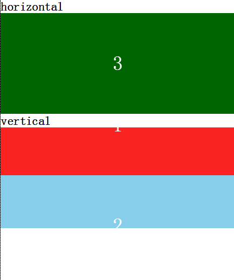
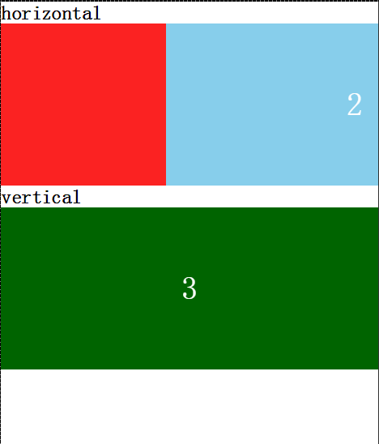

#TouchSlide

A simple touch slide lib for mobile html page.

No dependency

##Usage

    new TouchSlide(containerId or containerObj[, options])

    eg:

    new TouchSlide(containerId or ) //default horizontal slide

    or

    new TouchSlide(containerId, {
        'orientation': TouchSlide.VERTICAL
    }) // vertical slide

#Demo

*****

